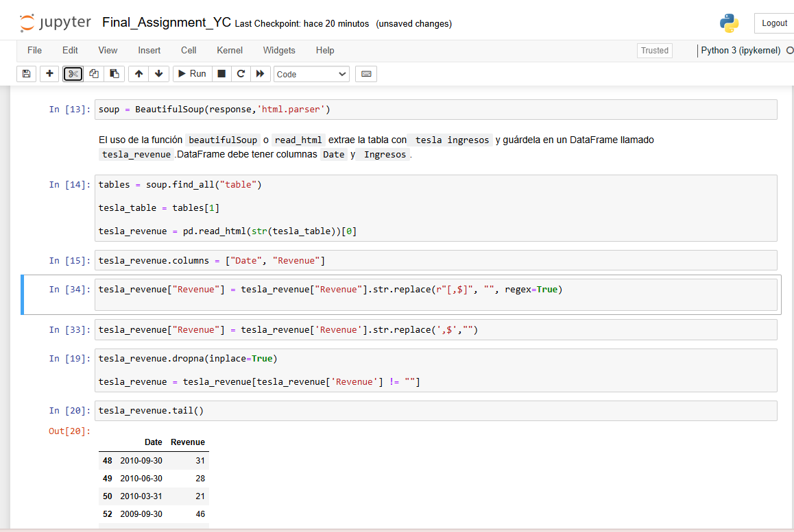
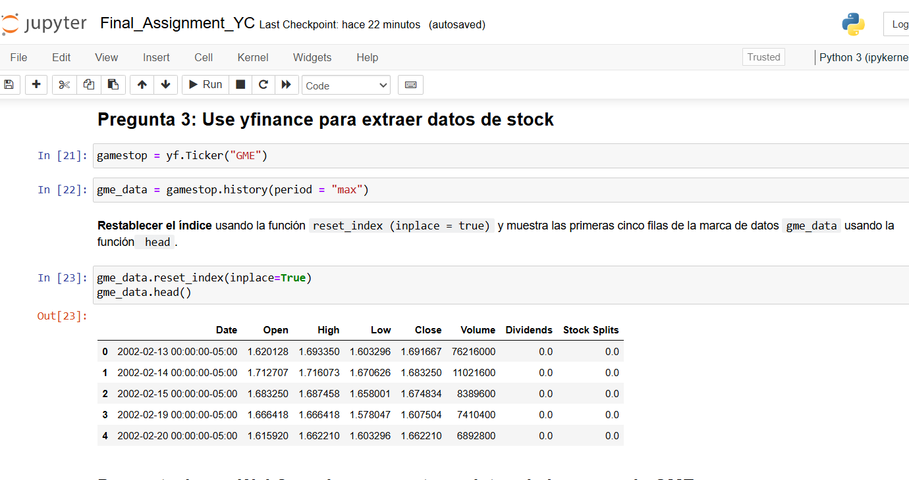
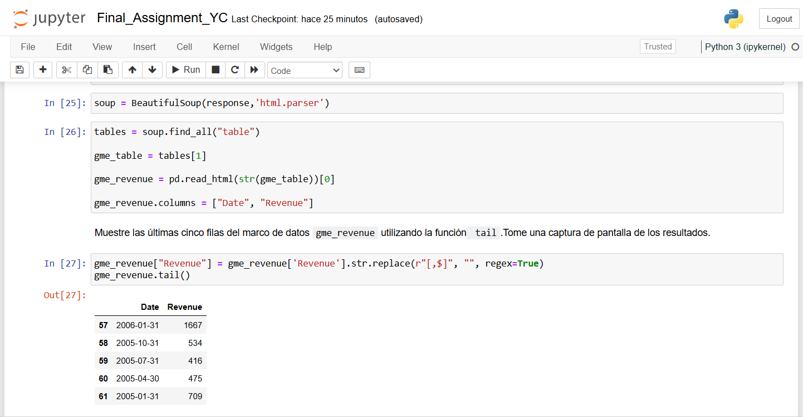
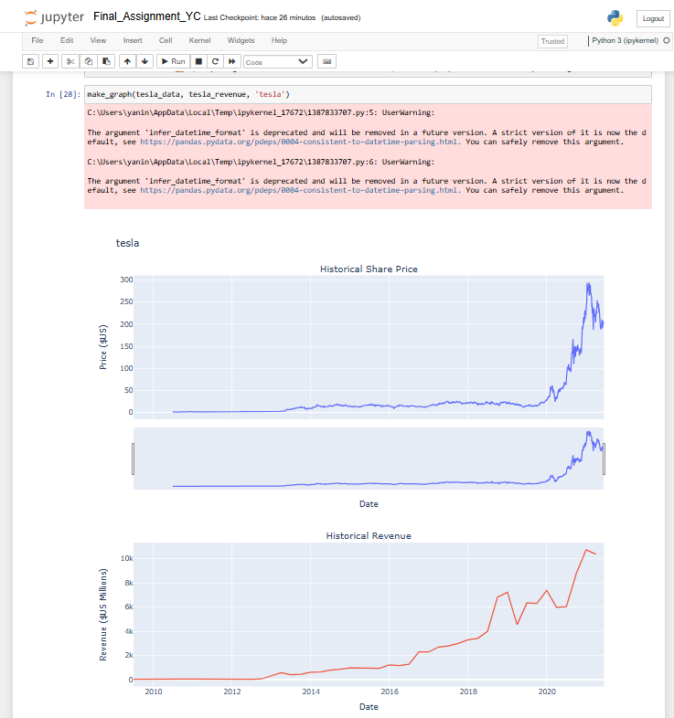
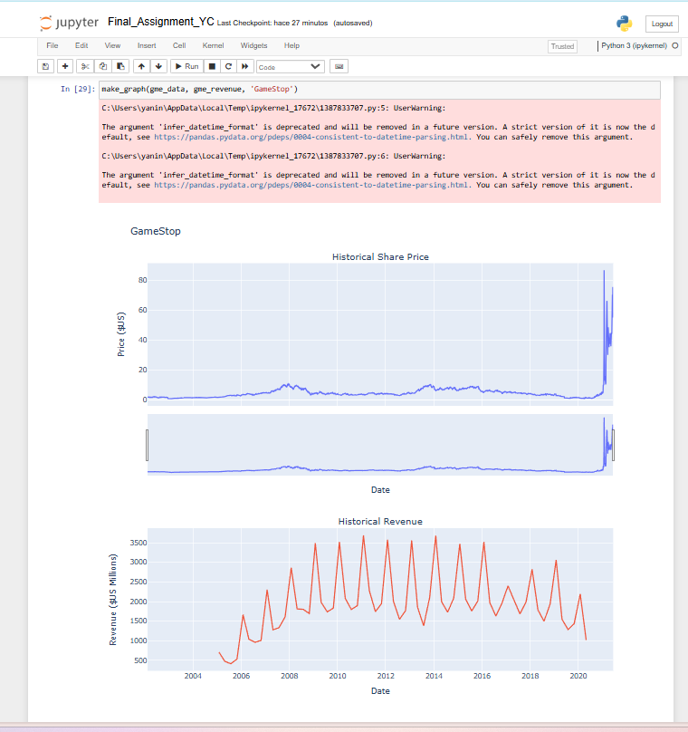

## 📊 Análisis de Datos Bursátiles con `yfinance` y Web Scraping  

### 📌 **Descripción del Proyecto**  
Este proyecto utiliza **Python**, la librería `yfinance` y técnicas de **web scraping** para extraer y analizar los datos financieros de **Tesla (TSLA)** y **GameStop (GME)**. Se han construido cuadros de mando para comparar el precio de las acciones con los ingresos de cada empresa.  

---

### 📂 **Contenido del Repositorio**  
🔹 `final_assignment_yfinance_webscraping.ipynb` → **Notebook Jupyter** con el análisis completo.  
🔹 `/imagenes` → Capturas de pantalla del código y resultados.  
🔹 `README.md` → Descripción del proyecto y cómo ejecutarlo.  

---

### 🚀 **Tecnologías Utilizadas**  
✅ **Python** 🐍  
✅ **Jupyter Notebook** 📓  
✅ **Librerías:** `yfinance`, `pandas`, `matplotlib`, `requests`, `BeautifulSoup`  

---

### 📌 **Cómo Ejecutar el Proyecto**  
1. **Descargar el repositorio**  
   - Puedes clonar el proyecto si tienes **Git** instalado:  
     ```sh
     git clone https://github.com/YaninaColangelo/final_assignment_yfinance_webscraping.git
     cd final_assignment_yfinance_webscraping
     ```
   - O descargar el proyecto como un archivo **.zip** y extraerlo en tu computadora.  

2. **Abrir el Notebook**  
   - Si tienes **Jupyter Notebook**, ejecuta:  
     ```sh
     jupyter notebook
     ```
   - Luego, abre el archivo **final_assignment_yfinance_webscraping.ipynb** y ejecuta las celdas.  

---

### 📊 **Visualizaciones**  
📌 **Gráficos de comparación** entre el precio de las acciones y los ingresos de Tesla y GameStop.  
📌 **Extracción de datos en tiempo real** usando `yfinance` y `web scraping`.  


## 📌 Preguntas del Proyecto

### 1️⃣ Extracción de datos de acciones de Tesla
Este fragmento de código muestra cómo se extrajeron los datos históricos de las acciones de Tesla utilizando `yfinance`.


---

### 2️⃣ Extracción de datos de ingresos de Tesla
Se obtiene la tabla de ingresos históricos de Tesla mediante Web Scraping con `BeautifulSoup`.



---

### 3️⃣ Extracción de datos de acciones de GameStop
Este fragmento muestra la obtención de datos históricos de las acciones de GameStop usando `yfinance`.



---

### 4️⃣ Extracción de datos de ingresos de GameStop
Mediante `BeautifulSoup`, se realiza Web Scraping para obtener los ingresos históricos de GameStop.



---

### 5️⃣ Visualización de acciones e ingresos de Tesla
Gráfico que representa la evolución histórica del **precio de las acciones** y los **ingresos de Tesla**.



---

### 6️⃣ Visualización de acciones e ingresos de GameStop
Gráfico que muestra la evolución del **precio de las acciones** y los **ingresos de GameStop**.


---

### 📬 **Créditos**  
Este notebook forma parte del curso **"IBM Data Science Professional Certificate"** en [Coursera](https://www.coursera.org/).  
